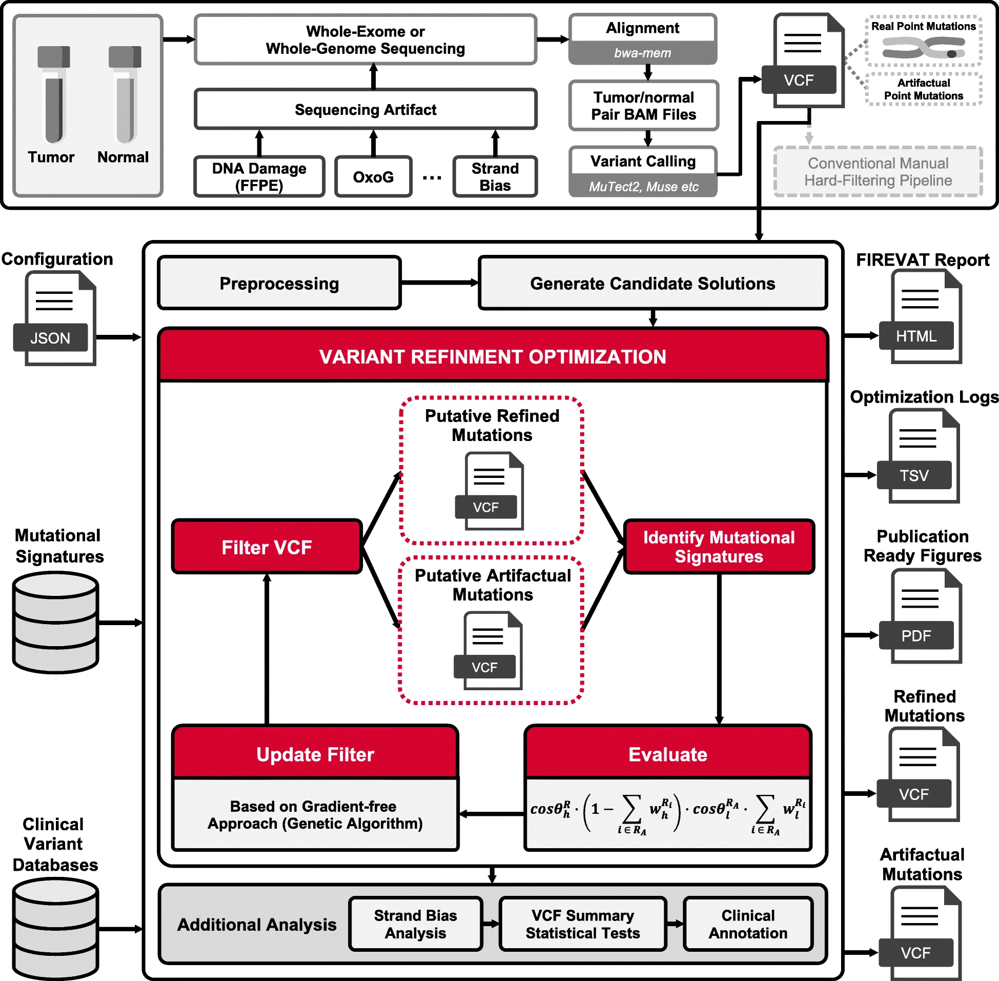

+++
title = "Firevat"
date = 2019-12-17
taxonomies.categories = ["project"]
taxonomies.tags = [
    "cancer", "mutation", "mutation-signature",
    "sequencing-artifact", "filtering", "r",
    "bioinformatics", "bioinformatics-software",
]
+++

[Repository](https://github.com/cgab-ncc/FIREVAT)
[Paper](https://genomemedicine.biomedcentral.com/articles/10.1186/s13073-019-0695-x)

FIREVAT is a somatic variant filtering tool based on mutational signatures.
It utilizes the signatures derived from sequencing artifacts to filter out
wrongly called somatic variants. FIREVAT optimizes filtering parameters
with genetic algorithm to maximize the number of true somatic variants.

