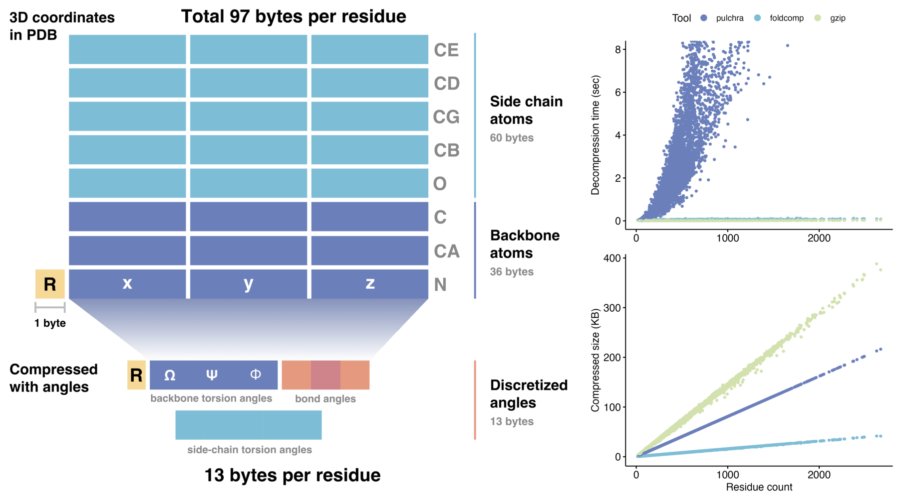
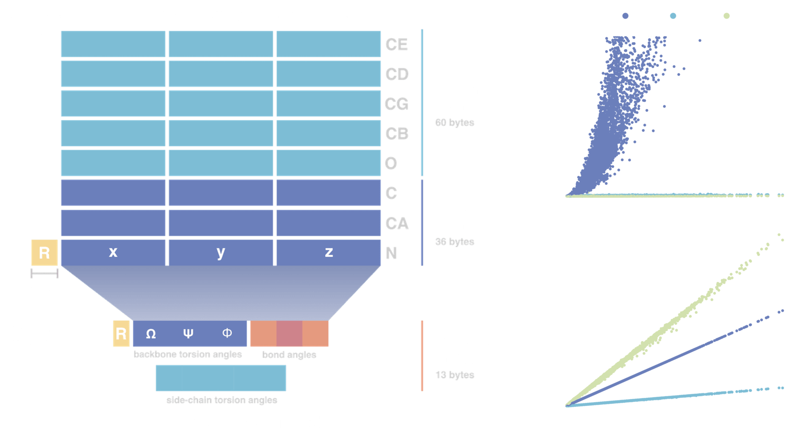

+++
title = "Foldcomp"
date = 2023-03-24
taxonomies.categories = ["project"]
taxonomies.tags = [
    "protein", "protein-structure",
    "compression", "c++",
    "bioinformatics", "bioinformatics-software",
]
+++

[Repository](https://github.com/steineggerlab/foldcomp)
[Presentation](https://www.youtube.com/watch?v=aFtqH0VqE7w)
[Paper](https://academic.oup.com/bioinformatics/article/39/4/btad153/7085592)
[Slides](ISMB2023_foldcomp_3dsig.pdf)
[ISMB2022 poster](FoldcompPoster1.pdf)
[ISMB2023 poster](FoldcompPoster2.pdf)

Foldcomp is a protein structure compression tool written in C++ which utilzes torsion angles
to represent protein structures in a compact format.
It compresses the backbone atoms to 8 bytes and the side chain to additionally 4-5 byes per residue, 
thus an averaged-sized protein of 350 residues requires ~6kb.
Foldcomp efficient compressed format stores protein structures requiring only 13 bytes per residue, which reduces the required storage space by an order of magnitude compared to saving 3D coordinates directly. 
We achieve this reduction by encoding the torsion angles of the backbone as well as the side-chain angles in a compact binary file format (FCZ).
By adopting MMseqs2's database format, we could reduce the file number as well.

<!-- [Subpage](subpage) -->
