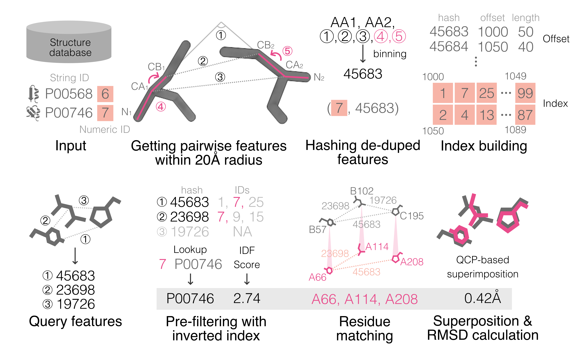

+++
title = "Folddisco"
date = 2025-01-01
taxonomies.categories = ["project"]
taxonomies.tags = [
    "protein", "protein-structure",
    "structural-motif", "motif", "rust",
    "bioinformatics", "bioinformatics-software",
]
+++

[Repository](https://github.com/steineggerlab/folddisco)
[Manuscript](https://www.biorxiv.org/content/10.1101/2025.07.06.663357v2)
[Poster1](AFolddiscoposter.pdf)
[Presentation](https://youtu.be/koLj0is_Y0s)
[Poster2](RECOMB2025_folddisco_poster.pdf)
[Slides](folddisco_recomb2025_postertalk.pdf)

Folddisco is a novel inverted-index method that overcomes earlier methods’ limitations and, for the first time, can detect structural motifs throughout entire protein databases. It also reduces the index size so that the full AlphaFoldDB can fit on a single disk, enabling large-scale motif searches on a single machine. Key innovations include a reduction in index storage by omitting location information, improved precision through a new side-chain orientation encoding feature, and significantly faster searching via an optimized index structure.
