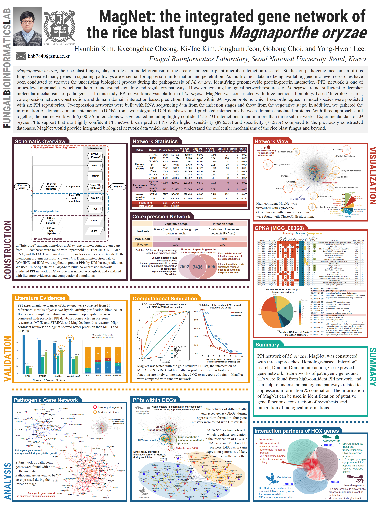

+++
title = "MagNet"
date = 2017-08-07
taxonomies.categories = ["project"]
taxonomies.tags = [
    "PPI", "protein-protein-interaction",
    "magnaporthe-oryzae", "rice-blast-fungus", "python", "r",
    "bioinformatics", "bioinformatics-analysis",
]
+++

[Website developed by Prof. Ki-Tae Kim's lab](https://magnet.scnu.ac.kr/) 
[Slides](magnet_presentation.pdf)

MagNet is a protein-protein interaction (PPI) network analysis platform of *Magnaporthe oryzae*.

